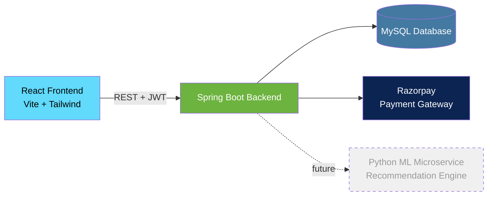

<div align="center">

<!-- Animated typing banner via readme-typing-svg (renders as live SVG on GitHub) -->


<br/>

<!-- Tech stack badges -->


<br/>


</div>

---

## 📖 About

**InsurAI** is a full-stack insurance management platform that digitizes the
traditional, paperwork-heavy insurance journey — policy discovery,
application, document verification, admin approval, and premium payment —
into a single transparent, secure, web-based flow.

Built as a **production-style learning project**, following a strict
layered architecture and a versioned roadmap (V1 → V6) so the codebase can
grow toward AI-powered recommendations and enterprise scale without
rewrites.

> 🎓 This is a portfolio / learning project, not a licensed insurance
> product. Policy data is illustrative.

<br/>

<details>
<summary><b>🎬 See it in action (click to expand)</b></summary>
<br/>

<!-- TODO: Replace with an actual screen-recording GIF of your app.
     Tools like ScreenToGif, Kap, or LICEcap work well for this — record a
     30-60s clip of: browse -> apply -> admin approve -> pay -> active,
     save as demo.gif, and drop it in a /docs or /assets folder in your repo. -->
<!-- # -->

```
docs/demo.gif   <-- put your recorded walkthrough here and it will render below
```


</details>

---

## ✨ Features (Version 1)

| | Feature |
|---|---|
| 🔐 | JWT authentication with Role-Based Access Control (User / Admin) |
| 📋 | Browse, search, and filter policies across 8 insurance categories |
| ✅ | Apply for a policy, track status (Pending → Approved/Rejected → Active) |
| 💳 | Razorpay premium payment with HMAC-SHA256 signature verification |
| 📄 | KYC document upload (Aadhar/PAN/Income Proof) with type & size validation |
| 📅 | Book a consultation appointment with an advisor |
| 🛠️ | Admin dashboard — manage policies, approve/reject applications, manage appointments |
| 🧠 | `UserActivity` tracking baked in from day one — silent data collection laying the foundation for the **V3 recommendation engine** |
| 🎨 | Modern animated frontend — React + Tailwind v4 + Framer Motion |

---

## 🏗️ Architecture



**Backend** follows a strict layered (N-tier) pattern:

```
Controller  →  Service (interface + impl)  →  Repository  →  Entity
     ↓                                                          ↑
   DTO  ←──────────────  ApiResponse<T> wrapper  ──────────────┘
```

- **DTOs** decouple the API contract from database entities
- **Service interfaces** allow swapping implementations without touching controllers
- **Global exception handler** (`@RestControllerAdvice`) gives every endpoint a consistent JSON response shape
- **Stateless JWT auth** — no server-side sessions, horizontally scalable by design

---

## 🧰 Tech Stack

<table>
<tr>
<td valign="top" width="50%">

**Backend**
- Java 21, Spring Boot 4
- Spring Data JPA (Hibernate)
- Spring Security + JWT
- MySQL 8
- Razorpay Java SDK
- Maven

</td>
<td valign="top" width="50%">

**Frontend**
- React 18 + Vite
- Tailwind CSS v4
- Zustand (state) + TanStack Query (server state)
- React Hook Form + Zod
- Framer Motion
- Axios (JWT interceptor)

</td>
</tr>
</table>

---

## 🚀 Getting Started

<details>
<summary><b>1️⃣ Backend Setup</b></summary>

```bash
cd backend

# Configure src/main/resources/application.yaml with your MySQL credentials
# and Razorpay test keys (see application.yaml.example)

mvn clean install
mvn spring-boot:run
```

Backend runs at `http://localhost:8080`.

</details>

<details>
<summary><b>2️⃣ Frontend Setup</b></summary>

```bash
cd frontend
npm install

# Confirm .env points at your backend:
# VITE_API_BASE_URL=http://localhost:8080/api/v1

npm run dev
```

Frontend runs at `http://localhost:5173`.

</details>

<details>
<summary><b>3️⃣ Test the full flow</b></summary>

1. Register a new account
2. Browse policies → apply to one
3. Log in as an admin (`role = ADMIN` in the `users` table) → approve the application
4. Back as the user → pay the premium via Razorpay test checkout
   (`4111 1111 1111 1111`, any future expiry/CVV)
5. Application status becomes `ACTIVE` 🎉

</details>

---

## 📡 API Overview

<details>
<summary><b>Click to expand full endpoint list</b></summary>

| Method | Endpoint | Access | Description |
|---|---|---|---|
| POST | `/api/v1/auth/register` | Public | Create account |
| POST | `/api/v1/auth/login` | Public | Get JWT token |
| GET | `/api/v1/policies` | Public | List active policies |
| GET | `/api/v1/policies/category/{cat}` | Public | Filter by category |
| GET | `/api/v1/policies/{id}` | Public | Policy detail |
| POST | `/api/v1/policies/admin/create` | Admin | Create policy |
| PATCH | `/api/v1/policies/admin/{id}/deactivate` | Admin | Deactivate policy |
| POST | `/api/v1/applications/apply` | User | Apply for a policy |
| GET | `/api/v1/applications/my` | User | Track own applications |
| GET | `/api/v1/applications/admin/all` | Admin | View all applications |
| PATCH | `/api/v1/applications/admin/{id}/status` | Admin | Approve/reject |
| POST | `/api/v1/payments/create-order` | User | Create Razorpay order |
| POST | `/api/v1/payments/verify` | User | Verify payment signature |
| POST | `/api/v1/documents/upload` | User | Upload KYC document |
| PATCH | `/api/v1/documents/admin/{id}/verify` | Admin | Mark document verified |
| POST | `/api/v1/appointments/book` | User | Request a consultation |
| GET | `/api/v1/appointments/admin/all` | Admin | View all appointments |

</details>

---

## 🗺️ Roadmap

- [x] **V1 — Foundation**: Auth, Policy CRUD, Applications, Exception Handling, JWT + RBAC, UserProfile/Activity tracking
- [x] **V2 (partial) — Production Enhancements**: Payment (Razorpay), Appointment Booking, Document/KYC Upload
- [ ] **V2 (remaining)**: Email notifications, pagination/filtering, audit trail, unit tests, Swagger docs
- [ ] **V3 — AI Features**: Recommendation engine (Python microservice), RAG-based chatbot
- [ ] **V4 — Advanced Backend**: Claims module, Redis caching, rate limiting, resilience patterns
- [ ] **V5 — Cloud & DevOps**: Docker, CI/CD, cloud deployment, monitoring
- [ ] **V6 — Enterprise Scale**: Microservices split, API gateway, OAuth2/SSO, event streaming

> Every module is designed to be **extensible without rewrites** — DTOs
> decouple the API from entities, service interfaces allow swapping
> implementations, and `UserActivity` logging started in V1 specifically
> so V3's recommendation engine has training data ready when it's built.

---

## 📸 Screenshots

<!-- TODO: Replace with actual screenshots of your running app -->
<!-- # -->

<table>
<tr>
<td></td>
<td></td>
</tr>
<tr>
<td align="center"><sub>Home — category browsing</sub></td>
<td align="center"><sub>Admin dashboard</sub></td>
</tr>
</table>

---

## 📄 License

MIT — free to use for learning and portfolio purposes.

<div align="center">
<br/>

⭐ If this project helped you understand production-style Spring Boot + React architecture, consider starring it!

</div>
