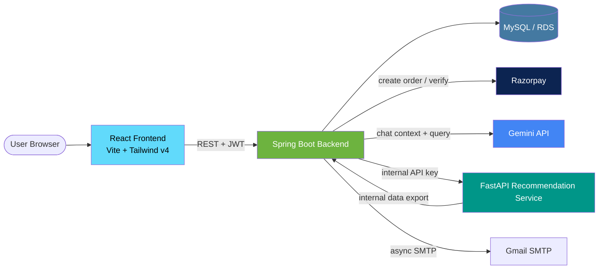
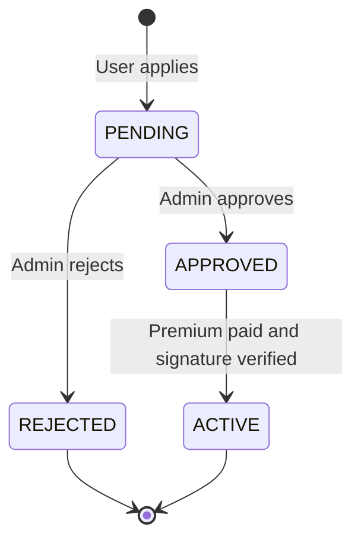
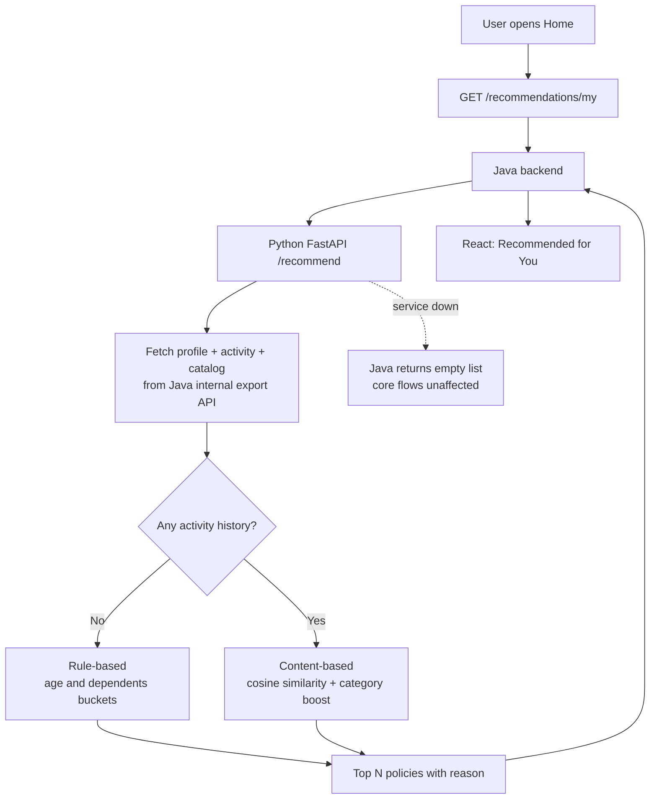
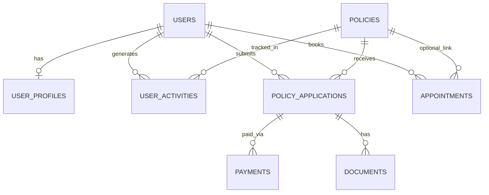

<div align="center">

<!-- Animated typing banner (live SVG, renders on GitHub) -->


<br/>


-success?style=flat-square)


</div>

---

## 📖 About

**InsurAI** digitizes the paperwork-heavy insurance journey end to end:
a customer discovers policies, gets **personalized recommendations**, asks a
**chatbot** questions, applies, uploads KYC documents, pays the premium via
Razorpay, and tracks status in real time — while admins manage policies and
approve or reject applications from a dashboard, with every action written
to an immutable audit trail.

It is built as a **versioned, production-style learning project**
(V1 → V6 roadmap). Each version adds capability without rewriting the
previous one — the layered architecture, DTO boundaries, and service
interfaces are what make that possible.

> 🎓 Portfolio / learning project — not a licensed insurer. Policy data is
> illustrative (80 seeded policies across 8 categories).

<details>
<summary><b>🎬 Demo (click to expand)</b></summary>
<br/>

<!-- TODO: Replace with a real screen recording (ScreenToGif / Kap / LICEcap).
     Suggested 45s flow: browse -> chatbot question -> apply -> admin approve -> pay -> ACTIVE
     Save as docs/demo.gif -->
<!-- # -->


**Live link:** <!-- TODO: paste your Amplify URL here after deployment --> _coming soon_

</details>

---

## ✨ What's Implemented

<table>
<tr>
<td width="50%" valign="top">

### 👤 Customer
- 🔐 JWT authentication (register / login)
- 🔎 Browse, search, filter 80 policies across 8 categories
- 📄 Policy detail with benefits and terms
- ✅ Apply and track status: `PENDING → APPROVED → ACTIVE`
- 📎 KYC upload (Aadhar / PAN / Income proof / Medical)
- 💳 Razorpay premium payment with signature verification
- 📅 Book an advisor consultation
- 🤖 Gemini-powered policy chatbot
- ✨ Personalized "Recommended for You"
- 🧬 Profile (age, income bracket, dependents, smoker) feeding the recommender
- 📧 Email on approval / rejection / payment

</td>
<td width="50%" valign="top">

### 🛠️ Admin
- 🔒 Role-based access (`USER` / `ADMIN`)
- 📋 Create and deactivate policies
- ✅ Approve / reject applications with remarks
- 🗂️ Paginated, filterable application queue
- 📅 Manage appointment requests
- 📄 Verify uploaded documents
- 🧾 **Immutable audit trail** of every admin action
- 📖 Live Swagger / OpenAPI documentation

### ⚙️ Platform
- 🧱 Layered architecture, DTO boundaries, service interfaces
- 🧯 Global exception handling, uniform `ApiResponse<T>` envelope
- 📑 Pagination + sorting on listing endpoints
- ⚡ Async email via dedicated thread pool
- 🧠 Python microservice for recommendations

</td>
</tr>
</table>

---

## 🏗️ Architecture


```mermaid
graph LR
    U([User Browser]) --> F[React Frontend<br/>Vite + Tailwind v4]
    F -->|REST + JWT| B[Spring Boot Backend]
    B --> DB[(MySQL / RDS)]
    B -->|create order / verify| RZ[Razorpay]
    B -->|chat context + query| GM[Gemini API]
    B -->|internal API key| PY[FastAPI Recommendation Service]
    PY -->|internal data export| B
    B -->|async SMTP| ML[Gmail SMTP]

    style F fill:#61DAFB,color:#000
    style B fill:#6DB33F,color:#fff
    style DB fill:#4479A1,color:#fff
    style PY fill:#009688,color:#fff
    style RZ fill:#0C2451,color:#fff
    style GM fill:#4285F4,color:#fff
```

**Backend layering**

```
Controller  ->  Service (interface + impl)  ->  Repository  ->  Entity
    |                                                              ^
   DTO  <------------  ApiResponse<T> envelope  -------------------+
```

---

## 🔄 Application Lifecycle


```mermaid
stateDiagram-v2
    [*] --> PENDING: User applies
    PENDING --> APPROVED: Admin approves
    PENDING --> REJECTED: Admin rejects
    APPROVED --> ACTIVE: Premium paid and signature verified
    REJECTED --> [*]
    ACTIVE --> [*]
```

Only `PENDING` applications can be decided, a decided application can never
return to `PENDING`, and every transition is written to the audit log with
the acting admin's email.

---

## 🧠 Recommendation Engine (Hybrid)


```mermaid
flowchart TD
    A[User opens Home] --> B[GET /recommendations/my]
    B --> C[Java backend]
    C --> D[Python FastAPI /recommend]
    D --> E[Fetch profile + activity + catalog<br/>from Java internal export API]
    E --> F{Any activity history?}
    F -- No --> G[Rule-based<br/>age and dependents buckets]
    F -- Yes --> H[Content-based<br/>cosine similarity + category boost]
    G --> I[Top N policies with reason]
    H --> I
    I --> C
    C --> J[React: Recommended for You]
    D -. service down .-> K[Java returns empty list<br/>core flows unaffected]
```

| Stage | Approach |
|---|---|
| **Cold start** (no activity) | Demographic rules: age bucket × dependents → preferred categories |
| **With activity** | Min-max normalized user vector vs policy vector, **cosine similarity**, plus a boost for categories the user already viewed |
| **Safety** | Already-applied policies are never re-recommended |
| **Failure mode** | Recommender down → empty list, never an error |
| **Privacy** | User data stays inside our own services — nothing is sent to a third-party model |

`UserActivity` logging was introduced in V1 specifically so training and
scoring data would already exist by the time V3 was built.

---

## 🤖 Chatbot

Gemini-backed assistant using **context injection**: the live policy catalog
is placed in the system context on every request, so answers reference real
policies instead of invented ones. The API key never leaves the backend; the
browser only talks to `/api/v1/chat/ask`.

At ~80 policies this is simpler and cheaper than a vector store. A full RAG
pipeline (embeddings + retrieval) is the natural next step once the catalog
or the document set grows.

---

## 🗄️ Data Model


```mermaid
erDiagram
    USERS ||--o| USER_PROFILES : has
    USERS ||--o{ USER_ACTIVITIES : generates
    USERS ||--o{ POLICY_APPLICATIONS : submits
    USERS ||--o{ APPOINTMENTS : books
    POLICIES ||--o{ POLICY_APPLICATIONS : receives
    POLICIES ||--o{ USER_ACTIVITIES : tracked_in
    POLICIES ||--o{ APPOINTMENTS : optional_link
    POLICY_APPLICATIONS ||--o{ PAYMENTS : paid_via
    POLICY_APPLICATIONS ||--o{ DOCUMENTS : has
```

`AUDIT_LOGS` is deliberately standalone: a generic `(entityType, entityId)`
reference lets it log actions on any entity without a foreign key per type,
and its columns are non-updatable at the database level.

---

## 🧰 Tech Stack

<table>
<tr>
<td valign="top" width="33%">

**Backend**
- Java 21, Spring Boot 4
- Spring Data JPA / Hibernate
- Spring Security + JWT
- MySQL 8
- Razorpay Java SDK
- Spring Mail (async)
- SpringDoc OpenAPI
- Maven

</td>
<td valign="top" width="33%">

**Frontend**
- React 18 + Vite
- Tailwind CSS v4
- Zustand + TanStack Query
- React Hook Form + Zod
- Framer Motion
- Axios (JWT interceptor)
- Lucide icons

</td>
<td valign="top" width="33%">

**AI / Services**
- FastAPI + Uvicorn
- NumPy (vectorized similarity)
- Google Gemini API
- Internal service-to-service auth (shared API key)

</td>
</tr>
</table>

---

## 🚀 Getting Started

<details>
<summary><b>1️⃣ Database</b></summary>

```sql
CREATE DATABASE insurai_db;
```
Tables are created by Hibernate on first boot (`ddl-auto: update`). Then seed
the catalog once:
```bash
mysql -u root -p insurai_db < seed-policies.sql
```
Running the seed twice creates duplicates — check with
`SELECT COUNT(*) FROM policies;` (expected: 80).
</details>

<details>
<summary><b>2️⃣ Backend (Spring Boot)</b></summary>

Configure `backend/src/main/resources/application.yaml`:

| Property | Purpose |
|---|---|
| `spring.datasource.*` | MySQL connection |
| `jwt.secret` | JWT signing key (32+ chars) |
| `razorpay.key-id` / `key-secret` | Razorpay **test** keys |
| `spring.mail.*` | Gmail address + **App Password** |
| `gemini.api-key` | Google AI Studio key |
| `recommendation.service-url` | Python service URL (`http://localhost:8000`) |
| `recommendation.internal-api-key` | Shared secret, must match the Python `.env` |

```bash
cd backend
mvn spring-boot:run
```
Swagger UI: `http://localhost:8080/swagger-ui/index.html`
</details>

<details>
<summary><b>3️⃣ Recommendation service (Python)</b></summary>

```bash
cd recommendation-service
python -m venv venv
venv\Scripts\activate          # macOS/Linux: source venv/bin/activate
pip install -r requirements.txt
cp .env.example .env           # set INTERNAL_API_KEY to match the backend
uvicorn main:app --reload --port 8000
```
Health check: `http://localhost:8000/health`
</details>

<details>
<summary><b>4️⃣ Frontend (React)</b></summary>

```bash
cd frontend
npm install
# .env -> VITE_API_BASE_URL=http://localhost:8080/api/v1
npm run dev
```
Open `http://localhost:5173`.
</details>

<details>
<summary><b>5️⃣ Try the full flow</b></summary>

1. Register, then complete your profile (age, income, dependents)
2. Open a few policy pages — activity is logged silently
3. Return Home: **Recommended for You** reflects your profile and browsing
4. Ask the chatbot "which health plan suits a family of four?"
5. Apply for a policy, then approve it as an admin (`role = ADMIN` in `users`)
6. Pay via Razorpay test checkout — card `4111 1111 1111 1111`, any future expiry, any CVV
7. Status becomes `ACTIVE`; confirmation email arrives; the admin audit log shows each step
</details>

---

## 📡 API Overview

<details>
<summary><b>Full endpoint list</b></summary>

| Area | Method | Endpoint | Access |
|---|---|---|---|
| Auth | POST | `/api/v1/auth/register` · `/login` | Public |
| Policies | GET | `/api/v1/policies` · `/category/{cat}` · `/{id}` | Public (paginated lists) |
| Policies | POST / PATCH | `/api/v1/policies/admin/create` · `/admin/{id}/deactivate` | Admin |
| Applications | POST | `/api/v1/applications/apply` | User |
| Applications | GET | `/api/v1/applications/my` | User |
| Applications | GET / PATCH | `/api/v1/applications/admin/all` · `/admin/{id}/status` | Admin |
| Payments | POST | `/api/v1/payments/create-order` · `/verify` | User |
| Documents | POST / GET | `/api/v1/documents/upload` · `/my/application/{id}` · `/{id}/download` | User |
| Documents | PATCH | `/api/v1/documents/admin/{id}/verify` | Admin |
| Appointments | POST / GET | `/api/v1/appointments/book` · `/my` | User |
| Appointments | GET / PATCH | `/api/v1/appointments/admin/all` · `/admin/{id}/status` | Admin |
| Profile | GET / PUT | `/api/v1/profile/me` | User |
| Activity | POST / GET | `/api/v1/activity/log` · `/me` | User |
| Recommendations | GET | `/api/v1/recommendations/my` | User |
| Chatbot | POST | `/api/v1/chat/ask` | Public |
| Audit | GET | `/api/v1/audit-logs/admin` · `/admin/{type}/{id}` | Admin |
| Internal | GET | `/api/internal/data-export/user/{id}` | Service key only |

All responses use one envelope:
`{ success, message, data, errors?, timestamp }`
</details>

---

## 🧭 Key Design Decisions

| Decision | Why |
|---|---|
| **DTOs, never entities, over the wire** | No accidental field exposure (e.g. password); API contract evolves independently of the schema |
| **Service interface + impl** | Implementations swap (e.g. email provider) without touching controllers |
| **Razorpay signature verified server-side (HMAC-SHA256)** | A client cannot fake "payment success" |
| **Audit writes in `REQUIRES_NEW`** | An audit failure can never roll back the business action it describes |
| **Email is `@Async`, failures swallowed and logged** | Notification trouble never blocks or fails an approval |
| **Extension-based upload validation, UUID filenames** | Client `Content-Type` is spoofable; UUIDs prevent collisions and path traversal |
| **Recommender as a separate service** | Independent scaling and replacement; keeps user data in-house |
| **Graceful degradation on recommender failure** | A nice-to-have feature must never break apply / pay |
| **Gemini key stays server-side** | Anything shipped to the browser is public |
| **Context injection before full RAG** | Right-sized for ~80 documents; simpler and cheaper |

---

## 🗺️ Roadmap

- [x] **V1 — Foundation:** auth, policy CRUD, applications, exception handling, JWT + RBAC, profile + activity tracking
- [x] **V2 — Production enhancements:** Razorpay payments, KYC upload, appointments, async email, pagination, audit trail, Swagger
- [ ] **V2 leftover:** unit + integration tests (JUnit / Mockito)
- [x] **V3 — AI core:** hybrid recommendation microservice, internal data-export API, Gemini chatbot
- [ ] **V3 next:** RAG with embeddings, collaborative filtering once real interaction volume exists
- [ ] **V3 frontend:** chatbot widget, profile form, recommendation section *(in progress)*
- [ ] **Deployment:** RDS + Elastic Beanstalk + Amplify *(in progress)*
- [ ] **V4:** claims module, Redis caching, rate limiting, Resilience4j, AI-assisted risk scoring (decision support only)
- [ ] **V5:** Docker, CI/CD, monitoring, S3-backed storage
- [ ] **V6:** microservices split, API gateway, OAuth2, event streaming

---

## ⚠️ Known Limitations (stated honestly)

- Recommendations are **heuristic** (rules + cosine similarity), not a trained model — there is not yet enough interaction data to train one meaningfully
- The chatbot injects the catalog as context; it is not retrieval-based
- Uploaded documents currently use local disk storage (S3 planned)
- Automated test coverage is still pending
- Not a real insurer — no regulatory, underwriting, or claims logic

---

## 📸 Screenshots

<!-- TODO: add real screenshots to docs/ -->
<!-- # -->

<table>
<tr>
<td></td>
<td></td>
</tr>
<tr>
<td align="center"><sub>Home with hero carousel</sub></td>
<td align="center"><sub>Recommended for You</sub></td>
</tr>
<tr>
<td></td>
<td></td>
</tr>
<tr>
<td align="center"><sub>Gemini policy assistant</sub></td>
<td align="center"><sub>Admin dashboard</sub></td>
</tr>
</table>

---

## 📄 License

MIT — free to use for learning and portfolio purposes.

<div align="center">
<br/>

⭐ If this helped you understand production-style Spring Boot + React + a Python service working together, consider starring the repo.

</div>
