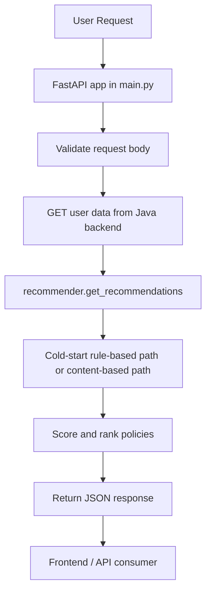
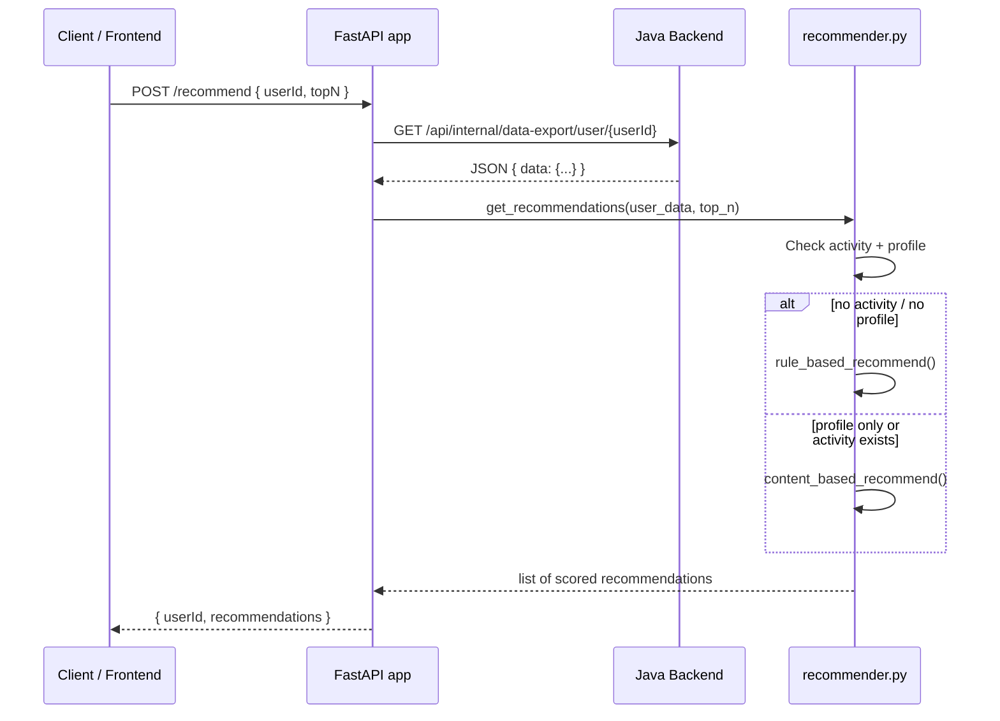
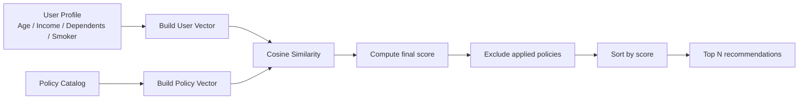
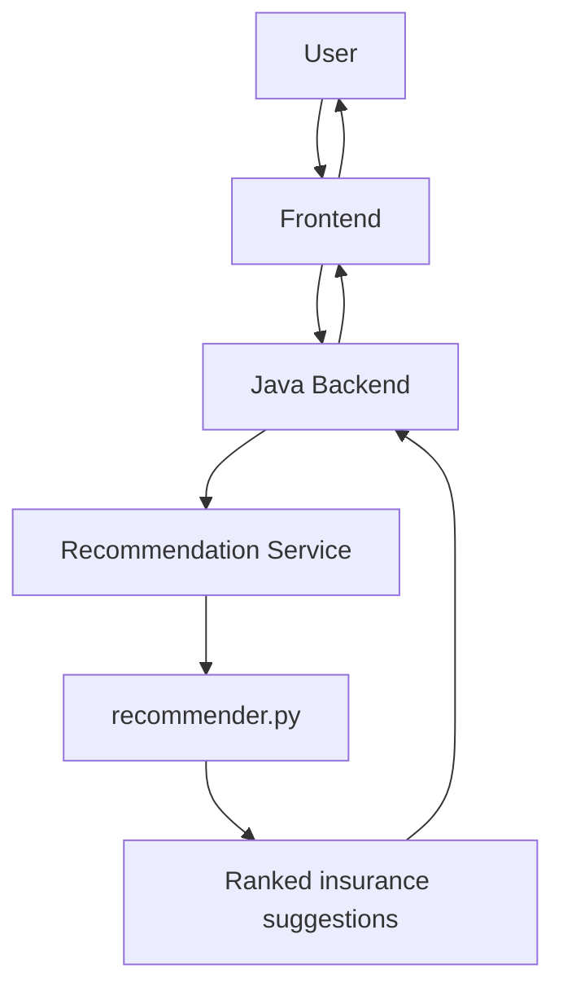

# 🧠 InsurAI Recommendation Service

This repository contains the recommendation microservice for InsurAI. It is a small Python service built with FastAPI that receives a user identifier, fetches that user’s profile and interaction data from the Java backend, and returns a ranked list of insurance products.

The service does not train a model on the fly. In the current implementation, it uses:

- a rule-based cold-start strategy for users with little or no activity
- a content-based recommendation approach based on demographic similarity and cosine similarity for users with profile/activity data

This is a production-oriented but lightweight recommendation layer designed to help users discover relevant insurance products based on their profile and prior browsing or application behavior.

## Architecture Overview

```mermaid
flowchart LR
    User --> Frontend[Frontend / Client App]
    Frontend --> Backend[Java Backend]
    Backend --> Export[Internal Data Export API\n/api/internal/data-export/user/{userId}]
    Export --> Python[Python Recommendation Service]
    Python --> Recommender[recommender.py\nAlgorithm Logic]
    Recommender --> Response[Recommendation Response]
    Response --> Backend
    Backend --> Frontend
```

The actual Python service is the component that receives a request, fetches user data from the backend, computes recommendations, and responds with scored policies.

---

## 1. 🎯 Purpose

### In simple terms
InsurAI needs a recommendation service because not every user knows which insurance product fits their situation. The service helps answer:

- “Which insurance products are most relevant to this user?”
- “What should we suggest first?”
- “What are the highest-priority policies for someone with this age, income, family, and activity profile?”

The service uses a user’s profile and historical interaction data to estimate which policy categories are most relevant and returns the best matches.

### Technical purpose
The recommendation logic in this repo is centered on matching a user profile against a policy catalog. It mainly uses:

- demographic rules for cold starts
- vector-based similarity for profile matching
- category preference logic
- policy ranking by score

It is designed for a small, fast, deterministic recommendation engine rather than a large ML pipeline.

### What type of recommendations it generates
The current implementation recommends insurance categories such as:

- `TERM_LIFE`
- `HEALTH`
- `TRAVEL`
- `MOTOR`
- `CHILD_PLAN`
- `RETIREMENT`
- `HOME`
- `GROUP_INSURANCE`

The actual recommendation engine is category-aware and uses age/dependent profile rules to prefer some categories over others.

---

## 2. 🏗️ Architecture



### Components

#### `main.py`
Entry point for the service. Creates the FastAPI app, defines the request schema, exposes the API routes, and fetches the user data from the Java backend.

#### `recommender.py`
Contains the actual recommendation logic. This is the core of the service.

#### `.env`
Stores local environment variables like the Java backend URL and internal API key.

#### `requirements.txt`
Lists the Python dependencies for the service.

#### Java backend
This service does not own the source of truth for the policy or user catalog. Instead, it requests data from the backend’s internal export API.

> Important: the backend API contract is not implemented in this repository. This service expects a JSON payload shaped like `{"data": ...}` with fields such as `policyCatalog`, `viewedPolicyIds`, `appliedPolicyIds`, and demographic values.

---

## 3. 📁 Project Structure

```text
recommendation-service/
├── .env
├── __pycache__/
├── main.py
├── recommender.py
├── requirements.txt
├── venv/
├── README.md
└── ...
```

### Important files

#### `main.py`
- Defines the FastAPI app
- Handles `GET /health`
- Handles `POST /recommend`
- Connects to the Java backend via `JAVA_BACKEND_URL`
- Calls `get_recommendations(...)`

#### `recommender.py`
- Implements the recommendation logic
- Defines category rules
- Builds user and policy vectors
- Calculates cosine similarity
- Returns scored recommendations

#### `.env`
- Local configuration file for runtime settings
- Used by `python-dotenv`

#### `requirements.txt`
- Runtime dependencies used by this service

#### `venv/`
- Local Python environment for running the service in this workspace

---

## 4. 🔄 End-to-End Request Flow

This is the actual flow implemented in the code.



### Step-by-step

1. A client sends a request to `POST /recommend` with a `userId` and optional `topN`.
2. `main.py` reads the Java backend URL from environment variables and calls:
   `GET {JAVA_BACKEND_URL}/api/internal/data-export/user/{request.userId}`
3. The service includes the header:
   `X-Internal-Api-Key: INTERNAL_API_KEY`
4. It expects the response JSON to contain a `data` object.
5. `get_recommendations(user_data, top_n=request.topN)` is invoked.
6. The recommender checks whether the user has prior activity or a profile.
7. It chooses either the cold-start rule-based flow or the content-based flow.
8. It returns a list of recommendation entries with `policyId`, `policyName`, `score`, and `reason`.

### Important data exchanged
The service expects the Java backend to return a payload containing values like:

```json
{
  "data": {
    "age": 32,
    "incomeBracket": "LPA_6_TO_10",
    "dependents": 2,
    "smoker": false,
    "viewedPolicyIds": [101, 202],
    "appliedPolicyIds": [303],
    "policyCatalog": [
      {
        "id": 101,
        "policyName": "Secure Life Plus",
        "category": "TERM_LIFE",
        "basePremium": 25000,
        "coverageAmount": 5000000,
        "tenureYears": 10
      }
    ]
  }
}
```

This is the key contract used by the service. The Python code does not independently query a database or data source.

---

## 5. 🧠 Core Recommendation Logic

### Input
The recommender receives `user_data`, which is expected to contain:

- `age`
- `incomeBracket`
- `dependents`
- `smoker`
- `viewedPolicyIds`
- `appliedPolicyIds`
- `policyCatalog`

The actual algorithm only uses these fields directly.

### Processing
The service performs two main types of processing.

#### A. Rule-based cold start
When the user has no profile and no activity, it falls back to a demographic rule map.

```python
CATEGORY_RULES = {
    "young_no_dependents": ["TERM_LIFE", "HEALTH", "TRAVEL", "MOTOR"],
    "young_with_dependents": ["CHILD_PLAN", "TERM_LIFE", "HEALTH", "HOME"],
    "mid_career": ["HEALTH", "RETIREMENT", "HOME", "TERM_LIFE"],
    "senior": ["RETIREMENT", "HEALTH", "HOME"],
}
```

The age/dependent bucket determines which categories are preferred. A higher-priority category receives a higher score.

#### B. Content-based recommendation
When the user has activity or a profile, the recommendation engine converts the user and policy into numeric vectors and scores them by cosine similarity.

### Recommendation
The service ranks policies using a combination of:

- user-to-policy similarity
- category preference
- interaction-based category boost for viewed/applied policies
- exclusion of already applied policies

### Ranking
The ranking strategy is implemented simply:

- compute a score per policy
- boost score by `0.15` if the policy category matches a previously interacted category
- sort descending by score
- take the top `N` results

### Output
Each recommendation entry includes:

```json
{
  "policyId": 101,
  "policyName": "Secure Life Plus",
  "score": 0.74,
  "reason": "Matches your profile and browsing interests"
}
```

The final response shape is:

```json
{
  "userId": 42,
  "recommendations": [
    {
      "policyId": 101,
      "policyName": "Secure Life Plus",
      "score": 0.74,
      "reason": "Matches your profile and browsing interests"
    }
  ]
}
```

---

## 6. 🧩 Core Concepts

### Recommendation System
A recommendation system suggests relevant items based on user profile and behavior. In this implementation, the recommendation logic is intentionally lightweight and deterministic.

### Rule-based Recommendation
Used for users with no profile or no activity. This is effectively a demographic heuristic system rather than a trained ML model.

### Content-Based Recommendation
This is the main non-cold-start strategy. It compares a user vector and a policy vector using similarity scoring.

### Cosine Similarity
The project defines:

```python
similarity(A, B) = (A · B) / (|A| * |B|)
```

In plain English, it measures how aligned two vectors are. A higher value means the user profile is more similar to the policy profile.

### Vector Representation
The user vector contains four elements:

```python
[age_norm, income_norm, dependents_norm, smoker_flag]
```

The policy vector contains four elements:

```python
[category_risk, premium_norm, coverage_norm, tenure_norm]
```

This is a simple engineered feature representation rather than a learned embedding model.

### Filtering
The service performs two filtering steps:

- it excludes policies already in `appliedPolicyIds`
- it prefers categories based on demographics or past interaction

### Machine Learning / AI
This service does not currently use a trained ML model, embeddings, vector database, or external LLM. It is a rule + similarity engine, not a retrieval or learning pipeline.

> Not currently evident from the implementation: there is no model artifact, embedding store, or vector database integration in this repository.

---

## 7. 🔬 Recommendation Algorithm — Visual Explanation



### How the score is created
For a given user and policy:

1. Build a normalized user vector.
2. Build a normalized policy vector.
3. Compute cosine similarity.
4. Add a small category-based boost if the policy category matches prior interactions.
5. Clamp the final score to a maximum of `1.0`.
6. Sort descending and return the top `N`.

### Important detail
The service uses a simple handcrafted transformation, not a learned representation. For example:

- `age` is normalized to a value from `0` to `1`
- `incomeBracket` is mapped to a numeric range
- `dependents` is bounded and normalized
- `smoker` becomes a binary feature

This allows a policy and user profile to be compared numerically even though they are not from the same feature domain.

---

## 8. 📊 Example

### Example: new user with no browsing history
```json
{
  "userId": 12,
  "topN": 3
}
```

User data from backend:

```json
{
  "age": 29,
  "incomeBracket": "LPA_6_TO_10",
  "dependents": 1,
  "smoker": false,
  "viewedPolicyIds": [],
  "appliedPolicyIds": [],
  "policyCatalog": [
    { "id": 1, "policyName": "Secure Family Health", "category": "HEALTH", "basePremium": 30000, "coverageAmount": 15000000, "tenureYears": 10 },
    { "id": 2, "policyName": "Young Term Cover", "category": "TERM_LIFE", "basePremium": 18000, "coverageAmount": 10000000, "tenureYears": 12 },
    { "id": 3, "policyName": "Retirement Secure", "category": "RETIREMENT", "basePremium": 60000, "coverageAmount": 20000000, "tenureYears": 20 }
  ]
}
```

Because the user is under 30 and has dependents, the engine picks the `young_with_dependents` bucket, whose preferred category order is:

```text
[CHILD_PLAN, TERM_LIFE, HEALTH, HOME]
```

The scoring would therefore prefer `TERM_LIFE` and `HEALTH` products first, with a higher score assigned to categories earlier in the preference list. The final recommendation is a short list of policy names with scores and reasons.

### Example response
```json
{
  "userId": 12,
  "recommendations": [
    {
      "policyId": 2,
      "policyName": "Young Term Cover",
      "score": 0.93,
      "reason": "Popular choice for your age group (young with dependents)"
    },
    {
      "policyId": 1,
      "policyName": "Secure Family Health",
      "score": 0.8,
      "reason": "Popular choice for your age group (young with dependents)"
    }
  ]
}
```

This example is illustrative based on the actual logic in the code, but the exact scores depend on the catalog and user data returned by the backend.

---

## 9. 🔌 API Documentation

### `GET /health`

#### Purpose
Checks whether the service is running.

#### Request
No body.

#### Response
```json
{
  "status": "ok"
}
```

#### Flow
```text
Request
  ↓
GET /health
  ↓
FastAPI route
  ↓
Response {"status": "ok"}
```

---

### `POST /recommend`

#### Purpose
Fetches user data from the Java backend and returns a ranked insurance recommendation list.

#### HTTP Method
`POST`

#### Request body
```json
{
  "userId": 42,
  "topN": 5
}
```

#### Required fields
- `userId`: integer

#### Optional fields
- `topN`: integer, default `5`

#### Response
```json
{
  "userId": 42,
  "recommendations": [
    {
      "policyId": 101,
      "policyName": "Secure Life Plus",
      "score": 0.85,
      "reason": "Matches your demographic profile"
    }
  ]
}
```

#### Error cases
- If the Java backend cannot be reached: `502 Bad Gateway`
- If the backend responds with a non-200 status: the request raises `HTTPException` from `response.raise_for_status()`
- If the JSON payload does not contain `data`, the code may fail while accessing `response.json()["data"]`

#### Authentication requirements
The service sends an internal header:

```http
X-Internal-Api-Key: <INTERNAL_API_KEY>
```

This is not enforced in the FastAPI route itself. The actual security boundary is that the Java backend is expected to validate the caller.

---

## 10. 🛠️ Technology Stack

| Technology | Purpose |
| --- | --- |
| Python 3 | Primary language for the service |
| FastAPI | Web API framework |
| Pydantic | Request validation and schema definition |
| NumPy | Numeric vector math for cosine similarity |
| `requests` | HTTP client to call the Java backend |
| `python-dotenv` | Loads environment variables from `.env` |
| `uvicorn` | ASGI server for running the app |

### Dependency list
From `requirements.txt`:

```text
fastapi==0.115.0
uvicorn==0.32.0
requests==2.32.3
numpy==2.1.3
python-dotenv==1.0.1
pydantic==2.9.2
```

---

## 11. ⚙️ Setup & Installation

### Prerequisites
- Python 3.10+ (not explicitly pinned in this repo, but the project is designed for a standard Python environment)
- Access to the Java backend running at the configured URL
- A valid `INTERNAL_API_KEY` if the backend requires it

### Installation

```bash
cd recommendation-service
python -m venv venv
# Windows
venv\Scripts\activate
# macOS / Linux
# source venv/bin/activate
pip install -r requirements.txt
```

### Environment variables
The project uses `python-dotenv` to read environment variables from `.env`.

Example:

```env
JAVA_BACKEND_URL=http://localhost:8080
INTERNAL_API_KEY=your_internal_api_key_here
```

#### Notes
- `JAVA_BACKEND_URL` defaults to `http://localhost:8080` if not set.
- `INTERNAL_API_KEY` is read from the environment and sent as an internal API header.
- The service does not currently validate or rotate secrets in code; secret handling is externalized to the environment.

### Run locally

```bash
uvicorn main:app --reload --host 0.0.0.0 --port 8000
```

This starts the service on port `8000` by default.

### Verify
Check health:

```bash
curl http://localhost:8000/health
```

Expected response:

```json
{"status":"ok"}
```

Test the recommendation endpoint:

```bash
curl -X POST http://localhost:8000/recommend \
  -H "Content-Type: application/json" \
  -d '{"userId": 1, "topN": 5}'
```

---

## 12. 🧪 Testing

### Current status
There are no automated tests in this repository at the moment.

The current checkout includes:

- `main.py`
- `recommender.py`
- `.env`
- `requirements.txt`

There is no `tests/` directory, no `pytest` config, and no CI pipeline evidence in this folder.

### What is currently tested implicitly
The service is only checked by manual run/testing at the HTTP route level, for example:

- health check returns a successful payload
- the recommendation endpoint returns a JSON response
- the backend data export endpoint is reachable

### How to manually validate
Use:

```bash
curl http://localhost:8000/health
curl -X POST http://localhost:8000/recommend -H "Content-Type: application/json" -d '{"userId": 1, "topN": 5}'
```

If the backend is not running, the service will fail with a `502` due to the upstream request issue.

---

## 13. 🐛 Error Handling

The service handles several real failure modes in the current code.

### Invalid input
The request schema is defined with Pydantic:

```python
class RecommendRequest(BaseModel):
    userId: int
    topN: int = 5
```

This means malformed requests are rejected by FastAPI/Pydantic before reaching the business logic.

### Missing fields
The `get_recommendations` function is defensive and uses `.get(...)` on dictionaries. For example:

- `user_data.get("age")`
- `user_data.get("incomeBracket")`
- `user_data.get("dependents") or 0`

If a field is missing, the code usually falls back to a default rather than crashing.

### Invalid user data
If the user is missing age and activity, it uses a default view of a `mid_career` profile in the cold-start logic.

### No recommendation available
If the policy catalog is empty, there are no items to score. The code will effectively return an empty list after sorting an empty list.

### External service failure
If the Java backend is unavailable or times out, the code raises:

```python
raise HTTPException(status_code=502, detail=f"Could not reach data source: {e}")
```

### Model/API failure
There is no ML model or external AI model call in this repository, so there is no dedicated model failure path. The recommendation logic is local and pure Python.

### Database failure
There is no direct database call in this service. The Python service relies on the Java backend as the data source.

---

## 14. 🔐 Security Considerations

### Currently implemented
- Environment variables are separated from code via `.env` and `python-dotenv`
- The Java backend API key is passed in an internal header instead of being hardcoded in application code
- Requests are validated by Pydantic for basic shape and types
- Upstream failures are mapped to HTTP 502 with a clear error message

### Not currently implemented in this service
- Authentication for the public FastAPI route itself
- Authorization logic for which users may request which recommendations
- Rate limiting
- CORS configuration
- Input sanitization beyond request validation
- Encryption for in-flight or at-rest sensitive data beyond normal TLS expectations

### Potential future improvements
- Add user identity validation and authorization checks
- Add secret management through Azure Key Vault or equivalent
- Restrict internal endpoint access to trusted services only
- Add request rate limiting and abuse protection
- Add audit logging for recommendation requests and upstream data access

---

## 15. ⚡ Performance Considerations

### Current design
The service uses lightweight computation rather than heavy model inference.

#### Complexity
If there are `N` policies in the current catalog, the algorithm essentially does:

- one pass over all policies in the rule-based approach
- one pass over all policies in the content-based approach

This makes the service roughly linear in the number of candidate policies:

```text
Time complexity ≈ O(N)
```

The vector operations are small fixed-size arrays, so the runtime is dominated by the number of policies evaluated rather than by matrix-heavy math.

### Performance characteristics
- No persistent model loading
- No database query overhead in this repo
- No caching layer
- Low latency expected for a small catalog
- Secondary network call to Java backend is the main external dependency

### Potential bottlenecks
- Slow Java backend response
- Large policy catalog
- Busy user history causing more processing per request
- No caching for repeated user recommendation requests

---

## 16. 📈 Observability & Debugging

This repository has minimal built-in observability. The key observability patterns currently present are:

- HTTP status responses from FastAPI
- backend request failures via `requests.exceptions.RequestException`
- explicit `HTTPException` with details when the upstream is unreachable
- simple `score` and `reason` data in the recommendation results

### What to inspect when recommendations look wrong

```text
Wrong recommendation
   ↓
Check Java backend payload
   ↓
Verify age / income / dependents / smoker values
   ↓
Check viewedPolicyIds / appliedPolicyIds
   ↓
Review policyCatalog categories and fields
   ↓
Trace rule-based or cosine-similarity path
   ↓
Check topN output and sorting
```

### Useful debugging points
- `main.py`: inspect the request flow and backend fetch
- `recommender.py`: inspect `rule_based_recommend`, `build_user_vector`, and `content_based_recommend`
- `.env`: verify the backend URL and internal key

### Logging
There are no structured logs or metrics in this service. The code does not currently emit detailed trace logs for each scoring decision.

---

## 17. 🔗 Integration with InsurAI



### Role of each layer
#### Frontend
Provides the user-facing interface and initiates actions that require recommendations.

#### Java Backend
Acts as the main data source and integration layer. It exposes the internal export API for the user and policy data.

#### Recommendation Service
Turns the internal data into relevant insurance recommendations. It is separated from the main backend as a specialized ML/recommendation component.

### Why this separation makes sense
The separation is consistent with the current design because:

- the recommendation logic is encapsulated in a dedicated Python module
- backend data retrieval is decoupled from scoring logic
- the service can evolve independently from the Java application

This is a clean service boundary, even though the current implementation is lightweight and not yet a full standalone data platform.

---

## 18. 🚀 Future Improvements

### Short-term
- Add explicit validation for `policyCatalog` data shape
- Improve recommendation explanation quality
- Add error logging for debug and support work
- Support repeated requests with caching

### Medium-term
- Add feedback-driven personalization from user clicks, buys, or conversions
- Introduce more granular policy metadata for better matching
- Add A/B testing or ranking experiments
- Add recommendation history tracking for the same user

### Advanced
- Use a more robust similarity or ranking model
- Add machine learning-based personalization
- Consider embeddings or vector search for policy similarity
- Add explainability such as “because you are 30, have 2 dependents, and prefer health coverage”
- Add monitoring, metrics, and alerting around recommendation quality

These are future enhancements, not features currently implemented in this repo.

---

## 19. 👨‍💻 Developer Quick Start

1. Install dependencies
2. Configure `.env`
3. Start the service
4. Call `/health`
5. Call `/recommend`
6. Review `recommender.py` for the core logic

### Start here
1. `main.py` – request handling and API entry point
2. `recommender.py` – actual recommendation engine
3. `.env` – environment configuration
4. `requirements.txt` – dependency list

### Quick command sequence

```bash
cd recommendation-service
python -m venv venv
venv\Scripts\activate   # Windows
pip install -r requirements.txt
uvicorn main:app --reload --host 0.0.0.0 --port 8000
```

Then test:

```bash
curl http://localhost:8000/health
curl -X POST http://localhost:8000/recommend -H "Content-Type: application/json" -d '{"userId": 1, "topN": 5}'
```

---

## 20. 🧠 “In One Minute” Explanation

The InsurAI Recommendation Service takes a user ID, fetches the user’s profile and policy data from the Java backend, compares that user profile to available insurance policies using demographics and cosine similarity, and returns the most relevant products ranked by score.

In short:

- It receives a request from the API layer.
- It fetches user and policy data from the Java backend.
- It classifies the user into a demographic bucket if needed.
- It computes policy relevance using vector similarity and category preferences.
- It filters out already applied policies.
- It ranks the candidates by score.
- It returns a JSON list of recommendations.

---

## 21. ✅ Summary of what this code currently does

This repository currently implements a lightweight recommendation service with:

- a FastAPI route layer in `main.py`
- a rule-based cold-start algorithm for users with no activity
- a content-based recommendation engine using cosine similarity in `recommender.py`
- upstream data retrieval from the Java backend’s internal export endpoint
- JSON responses containing `userId` and ranked recommendations

It is not a fully fledged AI/ML recommendation platform yet, and there is no evidence in this codebase of trained models, embeddings, a vector DB, or external LLM integration.

> Not currently evident from the implementation: there is no persistent recommendation database, no model artifact, no caching layer, and no automated test suite in this repository.
